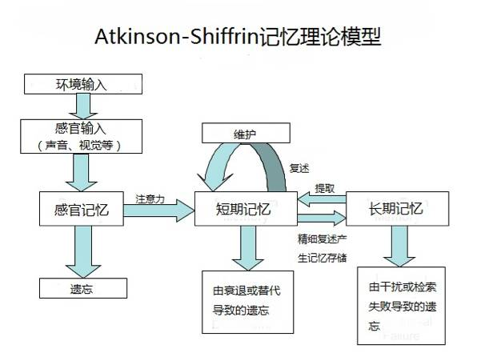
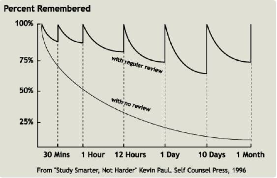

# 笔记法

## 笔记做得不好，可能会是无用功

### 阶段一

由上图可知，感官输入获得的感官记忆只有一部分能转化为短期记忆，那么需要怎样才能转化呢？

相信你有这样的经历：当你看一本书入迷的时候，你会意识不到周围发生了什么，比如其他人的声音，这些声音当然也是到了你的耳朵的。还有，如果你在一个地方住了很长时间，上班时，你一般不会注意到路上所遇到的人、事，你的大脑已经很熟悉它们，就不再把注意力放在上面了，而你旅行途中却决不会这样。

对，关键就是**注意力**。**人只有处于专注模式时，大脑的神经连接才会加强形成短期记忆**。换言之，如果不投入注意力，就算看到了听见了接收到了信息，也没办法形成短期记忆。

这一点就对应于一个**误区：上课忙着记笔记，把学习留在课后**。因为我们的目的本身并非笔记，而是知识的理解和记忆，那么注意力应当放在知识的理解上才更有效。

### 阶段二

人的短期记忆位于前额叶皮层，特点是容易使用但是也容易忘，需要频繁刷新记忆。长期记忆就像大货仓，记忆被分门别类的存放在大脑各处，它位于位于大脑皮层较深的地方。

我们都知道著名的**艾宾浩斯遗忘曲线**：

我们一般所说的记忆即是长期记忆，要想达到较高的记忆程度，方法就是**复习**。而复习的好方法即是本文的主题：**笔记**。

Seward Samuel Swayze Jr.在《Note-Taking》一书中指出，**笔记主要有两个功效：一是保存信息，二是帮助加深理解**。保存信息是最直接的作用，而加深理解更重要。为什么能加深理解呢？因为做笔记的时候，我们会试着用自己的语言来组织内容，这一过程伴随着把新知识融入进已有的知识体系，加深了理解。

要加深理解，还有两种方法：一是教（讲）给别人，所谓教学相长；二是找到例子来解释遇见的新理论。以上诸种，皆涉及新知识与已有知识的结合。

### 复习的方法

在复习阶段，你需要的不是简单的重学一遍（机械性复习），而是**把知识进行处理，变成更深层次的信息**。长期记忆可类比于将书籍登录进图书馆，我们需要将其分类、做笔记，日后容易检索，一索引二检索。仅仅浏览是不能达到这种效果的。

收到一个新的包裹后，需要对包裹里的物品进行分析、检查、试用后再把它分类别类的放到相应的架子上，以便日后的查找。对拆包、分拣、取用的过程，实际上就是在**不断地重复强化大脑皮层深处各个记忆块（chunk）之间的神经通路**。只有这样才能真正了解和掌握，才能学以致用并最终达到融会贯通的目的。

### 小结

1. 笔记的两大主要作用是：

* 保存超选处理后的信息；
* 帮助学习、记忆并理解信息：我们记下的**原始笔记是对信息的一次加工**，而之后的**复习整理是对信息的二次加工**。这个过程可以在脑海中完成（**思考**），也可以**结合笔记做新的输出**（比如举例子、建模型、做思维导图等）。

2. 要做知识的思考者，不做文字的搬运工。

做笔记的时候要进行思考取舍，把注意力放在课堂上，而不是一味的写笔记。记笔记除了要知其然，还要知其所以然。

3. 经常光顾升级你的笔记，如此才能让笔记发挥更大的作用。

# 参考

[为什么你做了很多笔记，却只是无用功？](http://mp.weixin.qq.com/s?__biz=MzA4ODE1NzUxNw==&mid=404005887&idx=1&sn=c390ccb2123b92893f579f3937d4728f&scene=21#wechat_redirect)

