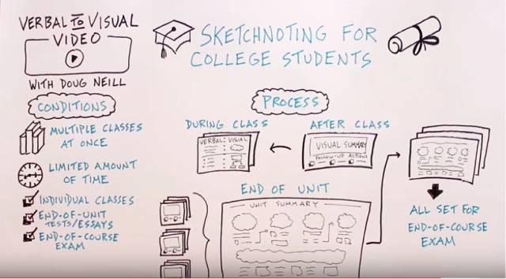

# 笔记法

## 笔记做得不好，可能会是无用功

### 阶段一

由上图可知，感官输入获得的感官记忆只有一部分能转化为短期记忆，那么需要怎样才能转化呢？

相信你有这样的经历：当你看一本书入迷的时候，你会意识不到周围发生了什么，比如其他人的声音，这些声音当然也是到了你的耳朵的。还有，如果你在一个地方住了很长时间，上班时，你一般不会注意到路上所遇到的人、事，你的大脑已经很熟悉它们，就不再把注意力放在上面了，而你旅行途中却决不会这样。

对，关键就是**注意力**。**人只有处于专注模式时，大脑的神经连接才会加强形成短期记忆**。换言之，如果不投入注意力，就算看到了听见了接收到了信息，也没办法形成短期记忆。

这一点就对应于一个**误区：上课忙着记笔记，把学习留在课后**。因为我们的目的本身并非笔记，而是知识的理解和记忆，那么注意力应当放在知识的理解上才更有效。

### 阶段二

人的短期记忆位于前额叶皮层，特点是容易使用但是也容易忘，需要频繁刷新记忆。长期记忆就像大货仓，记忆被分门别类的存放在大脑各处，它位于位于大脑皮层较深的地方。

我们都知道著名的**艾宾浩斯遗忘曲线**：

我们一般所说的记忆即是长期记忆，要想达到较高的记忆程度，方法就是**复习**。而复习的好方法即是本文的主题：**笔记**。

Seward Samuel Swayze Jr.在《Note-Taking》一书中指出，**笔记主要有两个功效：一是保存信息，二是帮助加深理解**。保存信息是最直接的作用，而加深理解更重要。为什么能加深理解呢？因为做笔记的时候，我们会试着用自己的语言来组织内容，这一过程伴随着把新知识融入进已有的知识体系，加深了理解。

要加深理解，还有两种方法：一是教（讲）给别人，所谓教学相长；二是找到例子来解释遇见的新理论。以上诸种，皆涉及新知识与已有知识的结合。

### 复习的方法

在复习阶段，你需要的不是简单的重学一遍（机械性复习），而是**把知识进行处理，变成更深层次的信息**。长期记忆可类比于将书籍登录进图书馆，我们需要将其分类、做笔记，日后容易检索，一索引二检索。仅仅浏览是不能达到这种效果的。

收到一个新的包裹后，需要对包裹里的物品进行分析、检查、试用后再把它分类别类的放到相应的架子上，以便日后的查找。对拆包、分拣、取用的过程，实际上就是在**不断地重复强化大脑皮层深处各个记忆块（chunk）之间的神经通路**。只有这样才能真正了解和掌握，才能学以致用并最终达到融会贯通的目的。

### 小结

1. 笔记的两大主要作用是：

* 保存超选处理后的信息；
* 帮助学习、记忆并理解信息：我们记下的**原始笔记是对信息的一次加工**，而之后的**复习整理是对信息的二次加工**。这个过程可以在脑海中完成（**思考**），也可以**结合笔记做新的输出**（比如举例子、建模型、做思维导图等）。

2. 要做知识的思考者，不做文字的搬运工。

做笔记的时候要进行思考取舍，把注意力放在课堂上，而不是一味的写笔记。记笔记除了要知其然，还要知其所以然。

3. 经常光顾升级你的笔记，如此才能让笔记发挥更大的作用。

## 高效笔记的三种方法

### 康奈尔笔记法

对于**听课笔记**来说，**康奈尔笔记法（也叫5R笔记法）是比较常见也比较有效的一种方法**。康奈尔笔记法是上个世界50年代康奈尔大学的教授Walter Pauk发明的一种笔记方法。这种笔记法把一页纸分成了三部分：左边四分之一左右（线索栏）、下方五分之一左右的空间（总结）和右上最大的空间（笔记）。

Tips

1. 写要点，不要照搬老师的全部讲解。
2. 灵活运用缩写和符号简化笔记。

为方便笔记，需组织自己的简写符号系统，可将该系统放在一个公用页上：）

#### 康奈尔笔记法的要点（5R）

1. 记录（Record）

在听讲或阅读过程中，在笔记栏内记下课程要点。尽量不要使用过长的句子，冗长的专业词汇最好简写。

2. 简化（Reduce）

记录以后，尽早将笔记栏的重点已关键词、简短标题、概念照样等方式写在侧栏中。

3. 背诵（Recite）

把笔记栏遮住，只根据线索栏中的摘记提示，尽量用自己的语言回忆复述笔记栏的内容。

4. 思考（Reflect）

这是**康奈尔笔记法中最精髓的一步**，其实就是把知识进行拓展和内在化的过程。在浏览记忆笔记之后，给自己留下一些时间进行消化。查漏补缺，澄清概念，加深理解，将自己的总结的内容写在下方的“总结栏”。

5. 复习（Review）

短期记忆很容易遗忘，间隔复习有助于加深记忆。每周话10分钟左右时间，快速复习笔记。

**康奈尔笔记法是一种集笔记、复习、自测和思考于一体的学习方法，而不仅仅是一种分区式笔记法**（理性地想想，仅仅分区是不会有帮助的）。在下一部分的两种方法介绍中可看到，预习和自测可以大幅提高学习效果。而康奈尔笔记法的精髓也在于此，因此并不是说，简简单单地把笔记分区就叫康奈尔笔记法。**记录（Record）之后的四个R才是重点。至于笔记的形式并不重要，你可以根据自己的需要，灵活改进应用。**

### 思维导图

这应该是我目前为止在常规笔记外尝试过的唯一一种笔记法，可用XMind这样的App，也可以用纸笔。以前之所以尝试该方法，很大程度上是因为，这是很自然的一种知识组织方法，当你需要在纸上把相关的点组织为一体时，可能会自然地使用起这种方法。

思维导图又叫心智图，是英国著名心理学家**Tony Buzan**发明的一种**表达发射性思维的图形思维工具**，在多个领域都有广泛的应用。思维导图具有形象生动，结构清晰，层次分明的特点，是一种趣味性比较强的笔记法。

虽然这种方法有很多优点，但它也不是万能的，也有自己的局限性。它是一种树状的信息分层可视化展视，结构比较固定，不适合分支间互相交互比较复杂的信息展示（比如记忆模型图）。可以配合其他思维工具一起使用，比如流程图、鱼骨图、SWOT分析等。

### 视觉笔记/涂鸦笔记

图为Doug Neill做的一张涂鸦笔记。

涂鸦笔记（也叫视觉笔记），是以内容丰富的视觉呈现笔记，混合了书写、绘画、手绘、版面设计、形状，以及诸如箭头、方框、线条等视觉元素。

视觉笔记让记笔记变的更有趣、更专注，积极聆听的同时画出属于自己的笔记，这样记忆深刻，还增添了笔记的可读性和传播性。但是不熟练的时候，会比较费时。

做涂鸦笔记一定要会画画么？

涂鸦笔记的难点和重点并不是绘画，而是信息的归纳和提炼，要在繁杂的大量信息中捕捉到要点。我们做笔记时，最重要的还是分析信息的结构、要点并记录当下自己的延伸思考。图像只是一种表现形式，即使我们无法有效地绘出精彩的图形，但只要掌握了知识的逻辑和要点便已经达到了学习的目的。

## 可与笔记结合的两种方法

有两种我们并不陌生的方法，与笔记结合起来，可取得良好的效果。

### 1、预先了解背景知识

1972年，JohnD. Bransford 和Marcia K.Johnson 做过一项关于背景信息对理解力影响的研究，并发表了一篇名为《Contextual Prerequisites for Understanding: Some Investigations ofComprehension and Recall》的论文。该研究显示，**提前得到背景信息的受试者在理解和回忆方面，表现都更佳**，而之后得到背景信息的组和无背景信息的组表现则差不多。

Bransford 和Johnson 的实验说明，提前得知背景信息对于我们提高理解力和短期记忆力非常有帮助，而之后得知的背景信息则并没有太大作用。对于我们学习来说，就是**预习会大幅提高我们的理解力和记忆力**。

从长期记忆的角度来看，背景信息可帮助我们对信息定位，而定位则有助于检索。类似于，若让你去图书馆找几本书，事先告诉你这些书是关于欧洲历史的，那么相比于什么都不告诉你，找起来速度会相差很多。再想一想，你看一本小说或电影时，是不是很希望看看它的简介或主角的背景故事？如果没有这些背景，至少开始的一段时间内，我们很难把各个点串联起来。

有了背景知识，新了解的知识会更容易地被吸收进已有的知识体系，因为预习的过程即是在已有的知识体系中做好标记。

#### 预习的反思

仔细想想，自己在中学时期一定是有不少预习的。只是毕业之后就没有机会进行真正的预习了，因为都是自学，也记得有段时间自认为自学能力还不错。

现在看来，某种程度的预习仍然可行，但不同的学科可能方法与效果不同。举例如下：

* 普通心理学：适合预习，很典型的。比如在认真阅读一章前，先了解其关键问题和核心概念，想一想，然后回来仔细阅读正文。其它类似的社科类读物也类似。
* 数学：如微积分、线性代数和概率论。这一方向，自己一直对”侵入性“的预习持抵触态度。大概是自己一直希望能自行推导和理解它，这样最有发现的满足感。这是没问题的，尽管去做。
* 小说：不消说，万不能”预习“，而且也没问题的。
* 文献：为解决一个问题，可能需要查阅二十本书和五十篇论文，这时不妨想想：你的目的是解决手头的问题，而不是通读所有文字，既如此，何不把所有文献看作”一本大书“？如此一来，”预习“可以帮助快速过滤，节省大量时间。

#### 如何预习

1. 完成指定阅读材料（或自行搜索）
2. 浏览课程大纲
3. 找出关键词，确定缩写（节省笔记时间）

### 2、通过测试进行巩固

2005年，华盛顿大学的Henry L.Roediger 和 Jeffrey D. Karpicke 做过一个实验。他们的研究结果发现，**就短期记忆来说“学习+学习”小组的效果更好**（短期记忆本来就需要重复），但是随着时间的增长，实验结果则出现了大的逆转。“学习+测试”小组的表现更好，他们的遗忘速度远远小于第一组。也就是说，**对长期记忆来说，即时测试的效果要远好于重复学习，对提高学习效果有事半功倍的效果**。如下图所示：

**测试不是单纯的考试**，尤其是自学的时候，我们更需要掌握自测这种技巧。因为**这是体现一个人自学能力强弱的一个很重要的方面**。自测的方法有很多，这里为大家推荐一个简单粗暴却又相当好用的方法——费曼技巧（The Feynman Technique）。

费曼技巧源于诺贝尔物理奖获得者理查德•费曼（Richard Feynman）。在他的自传里，他提到曾纠结于某篇艰深的研究论文。他的办法是仔细审阅相关资料，尝试用自己的方式表达，碰到困难的地方再次学习，直到他掌握相关知识基础、足以理解其中的艰深想法为止。

费曼技巧的具体步骤：

1. 选择一个你想要理解的概念

选择一个你想要理解的概念，然后拿出一张白纸，把这个概念写在白纸的最上边。
 
2. 假设你正在教别人这个概念

在白纸上写下你对这个概念的解释，就好像你正在教导一位新接触这个概念的学生一样。当你这样做的时候，你会更清楚地意识到关于这个概念你理解了多少，以及是否还存在理解不清的地方。
 
3. 如果你感觉卡壳了，就回顾一下学习资料

无论何时你感觉卡壳了，都要回到原始的学习资料并重新学习让你感到卡壳的那部分，直到你领会得足够顺畅，顺畅到可以在纸上解释这个部分为止。

4. 为了让你的讲解通俗易懂，简化语言表达

**最终的目的，是用你自己的语言，而不是学习资料中的语言来解释概念**。**如果你的解释很冗长或者令人迷惑，那就说明你对概念的理解可能并没有你自己想象得那么顺畅——你要努力简化语言表达，或者与已有的知识建立一种类比关系，以便更好地理解它**。

上述科学研究表明，**预习和自测都是小投入，大回报的学习方法**。而对于自学者而言，MOOC无疑提供了一个绝佳的机会，我们可以更容易地去完成”预习“与”自测“了。

## 总结

1. 高效的学习模式

笔记的目的是更好的学习，如果放弃学习的效果一味追求笔记本身则是本末倒置。一个高效的学习模式应该包括这样几个步骤：

2. 适合自己的笔记法

每一种笔记法都不是一成不变的，完全可以根据自己的需要加以改进和灵活应用，从而找到适合自己的方法。

# 参考

[为什么你做了很多笔记，却只是无用功？](http://mp.weixin.qq.com/s?__biz=MzA4ODE1NzUxNw==&mid=404005887&idx=1&sn=c390ccb2123b92893f579f3937d4728f&scene=21#wechat_redirect)

[掌握这两个小技巧，让你的学习事半功倍](http://mp.weixin.qq.com/s?__biz=MzA4ODE1NzUxNw==&mid=404112170&idx=1&sn=9340dcfac413bf1f9d988645d6f6744b&scene=21#wechat_redirect)

[高效笔记的三个方法](http://mp.weixin.qq.com/s?__biz=MzA4ODE1NzUxNw==&mid=404393903&idx=1&sn=aac693240377163514546419d06cb0ab&scene=2&srcid=0413DTpy7PQRgskVk1nwyrGS&from=timeline&isappinstalled=0#wechat_redirect)

