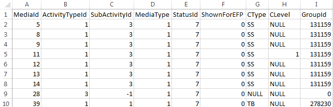
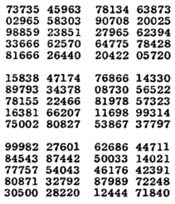

## 什么是统计学?

当我们谈论**统计学**时，我们在谈论什么？

- CPI
- 失业率
- Excel表格
- 饼图，柱状图
- 正态分布

说到底就是各种**数据**，统计学是关于**数据的科学和艺术**。


## 数据从何而来？

我们怎样才能相信看到的数据和图表？第一个该问的问题是：“这些数字是从哪里来的？”


## 数据基本术语

- 个体(individual)：数据描述的对象，如人、计算机或其它
- 变量(variable)：一个个体的某种特征或属性，如姓名、年龄或兴趣


两者类似于Excel Sheet中行和列，下面是一个例子：




变量可分为数量与类型两类。


## 方法一：观测研究（Observational Study）

- 了解黑猩猩的行为
- 老师与小学生在教室中的互动

Jane Goodall在坦桑尼亚的观测改变了人们的“黑猩猩是素食动物”的观点。

在观测之前，可能不清楚应记录什么，需要找到某些问题和模式，如黑猩猩多久猎食一次？单独行动还是群体行动？系统性的观测，加上清楚定义的变量，比只是观测更有说服力。

**观测**并不试图去影响回应（个体的回应）。


## 方法二：抽样调查（Sample Survey）

### 所谓管中窥豹

- 总体（population）：要了解的对象全体
- 样本（sample）：总体的一部分，通过这一部分推断总体的信息

常见的例子

- 民意调查（Gallup），总体是18岁以上美国居民，样本是接受过电话访谈的人
- 当前人口调查（CPS），总体是全部美国住户，样本是每月访谈的约50 000个住户

普查（Census）可认为是试图把整个总体纳入样本的抽样调查。


## 方法三：实验（Experiment）

与观测不同的是，实验的目的就是要改变行为。通过某些特定的处理（treatment），以观察某些反应。

- 一种药物的效果
- 人们在不看商标的情况下，喜欢可口可乐还是百事可乐
- 很多心理学研究

实验在科学研究中不可或缺，它可以为因果关系提供良好的证据。


## 样本的选择

- 一家报纸要求读者电话回应，是否赞成某公司的垄断 （3763次）
- 买橘者检查橘子的质量

- 强烈相关的人或容易被操控

**有偏的（Biased）**

统计问题的设计结果总是往某个方向偏。

- 自发性回应（Voluntary Response）
- 方便抽样（Convenience Sampling）

## 样本示例

**梅龙镇访谈**

- 外表整洁
- 不具威胁
- 收入较高

**专栏作家Ann Landers**的结论

- 如果可以重来一次，您还会要孩子吗？

高达70%的人的回应是否定的～！？

## 样本改进

- 减少人为因素的影响
- 机会均等

**简单随机样本（Simple Random Sampling）**

- 把人群的名字放进帽子，抽出一部分
- 随机数字表
- 计算机生成的随机数




## 样本在说什么

Gallup对随机选出的1523个成人访谈之后，得出结论：过去的12个月内，有57%的人购买过乐透彩票。

由一千多人推断出两亿人的信息，这样的结论可信吗？

Gallup补充道：我们有95%的信心，由于抽样或其它随机因素导致的误差，在正负三个百分点内。


## 样本到总体

- **参数**是描述总体的数字，是确定的，但无从知晓
- **统计量**是描述样本的数字，可以得出，以估计参数 （1523 - 868）

**抽样变异性（Variability）**

虽然一次调查无法完全对应到总体，但统计学上对**随机抽样**有更多的了解，重复抽取许多大小一样的样本，所有的变异遵循某种可预测的形态，这就是伟大的[正态分布][normal]。

样本量越大，误差范围越小。100：0.1; 1523: 0.024


## 抽样调查的两个特性

- 偏差 （瞄准镜有问题）
- 变异性 （随机性带来的误差）

我们期望的是**低偏差且低变异性**

- 简单随机抽样
- 较大的样本


## 误差界限

“误差界限是正负3个百分点”的意思是？

- 如果我们重复此次抽样同样的方法很多很多次，则其中会有**95%**的结果落在总体真实值的正负3个百分点之内。

没办法得出100%的结论，但媒体喜欢确定的结论，这就是生活。

速算法：

```{r, echo=TRUE}
# sample size is n, the margin of error is (only for 95%)
n = 1523
1 / sqrt(n)
```

## 回到现实

民意调查

- 2879个电话，1000个样本

更多的误差

- 抽样误差 （涵盖不全）
- 随机抽样调查
- 非抽样调查（处理误差，回应误差，无回应、拒绝合作）

你家有stock吗？
你是否赞成禁止私人拥有枪械以减低犯罪率？

- 无回应是最严重的问题（75%-80%）
- 一项抽样调查所公布的误差界限，仅包括随机抽样误差

分层抽样，可获得关于层的个别信息，误差界限通常比SRS小


## 对于调查的调查

- 谁做的？
- 总体是什么？
- 样本如何选取的？
- 样本多大？
- 回应率多少？
- 以何种方式联系受访者？电话，邮件还是面对面？
- 什么时候做的？（某次恐怖袭击刚刚发生？）
- 问题的措辞？

数据不会说谎，但骗子会。

## 实验

观测不干扰受访对象，实验则试图主动产生数据。

- 解释变量（自变量），可造成反应变量变化的变量
- 反应变量（因变量），度量结果
- 受试对象
- 加诸于受试对象的特定实验条件


网上修课的效果如何？如何确定？（诺瓦东南大学的研究）

- 潜在变量，对结果有影响但未被列入解释变量的变量
- 交叉，两个变量的影响混杂在一起

## 医学实验

胃冷冻疗法治疗胃溃疡，真的有效！？仅仅让医生看看结果就够了吗？

别忘了安慰剂效应

**观测**很难摆脱交叉现象，但实验可以。


## 随机化比较实验

- 处理组
- 控制组（安慰剂、在用药）

随机分组，并隔离交叉变量。随机化比较实验是统计学里最重要的概念之一，其目的是试图确定某种因果关系。

“历史对照组”的做法不是好方法。

**双盲法**

安慰剂效应不仅作用在病人上，也作用在医生上。

**自然疗法**

包治百病的安慰剂


## 统计显著性

分组结果的差异要足够大，也就是足够**显著**，以消除随机误差的作用。还是不能100%确定，但如果概率极小，那么就有足够的信心得出结论。


现实显著性更重要


## 度量什么？

现代人的空闲时间是多了还是少了？空闲时间是指？

- 卷尺
- SAT

要问的问题

变量是如何定义的？
变量能否有效地描述所声称的性质？


**失业率**

怎样算失业：属于劳动人口（可就业，两周内在寻找机会）。

**IQ**测试

## 质疑数据

- 数据是正确的，但不是事实的全部（上下文）
- 每英亩生产750 000颗瓜，即每平方英尺17.2颗
- 过分精确（物理实验和课本完全一样）
- 太有规律

Manager：这个story需要做多长时间？   
Dev：需要1.68天

**夏天多小偷？**   

您去度假的时候，据FBI的统计资料，26%的住宅资料发生在阵亡将士纪念日和劳动节之间。


## Slide with R Code and Output

```{r}
summary(cars)
```

## Slide with Plot

```{r, echo=FALSE}
plot(cars)
```

## 变量的选择

富人区与普通区的资源回收度量。P4


## Other Resources

* [可汗学院-统计学][khstats]
* [Markdown Cheatsheet][mdtutor]

[gallup]: www.gallup.com/poll
[cpshome]: www.bls.gov/cpshome.htm
[resrand]: www.randomizer.org
[normal]: http://songshuhui.net/archives/76501

[khstats]: http://v.163.com/special/Khan/khstatistics.html
[mdtutor]: https://github.com/adam-p/markdown-here/wiki/Markdown-Cheatsheet

