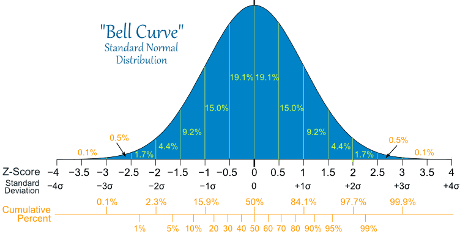

## 统计显著性

分组结果的差异要足够大，也就是足够**显著**，以消除随机误差的作用。还是不能100%确定，但如果概率极小，那么就有足够的信心得出结论。


现实显著性更重要


## test


A 2013 Pew Research poll found that 60% of 1983 randomly sampled American adults believe in evolution. Does this provide convincing evidence that majority of Americans believe in evolution?

(more than 50%?)

n <- 1983
ph <- 0.6
# h0: p == 0.5
se <- sqrt(0.5 * 0.5 / n)

conditions:
  < 10%
  randomly
  
  success/failure
  

## 看图说话

**比较-整体与部分**

```{r, echo=FALSE}
# install.packages("httpuv")
```

```{r, echo=FALSE}
slices <- c(150000, 20000, 5000)
lbls <- c("Image", "Video", "Audio")

pie(slices, labels=lbls, main="Media Type")
```

## 柱状图

```{r, echo=FALSE}
library(vcd)

opar <- par(no.readonly=TRUE)
par(mfcol=c(1, 2))

plot(Arthritis$Improved, main="Simple Bar Plot",
     xlab="Improvement", ylab="Frequency")

plot(Arthritis$Improved, main="Horizontal Bar Plot",
     xlab="Frequency", ylab="Improvement", horiz=TRUE)
```

par(opar)

## 线图、时间序列图


## 直方图（一）

```{r, echo=FALSE}
hist(mtcars$mpg,
     breaks=12,
     col="red",
     xlab="Miles Per Gallon",
     main="Colored histogram with 12 bins")
```

## 直方图（二）

```{r, echo=FALSE}
hist(mtcars$mpg,
     freq=FALSE,
     breaks=12,
     col="red",
     xlab="Miles Per Gallon",
     main="histogram, rug plot, density curve")
rug(jitter(mtcars$mpg))
lines(density(mtcars$mpg), col="blue", lwd=2)
box()
```

## 箱形图

```{r, echo=FALSE}
# Boxplot of MPG by Car Cylinders 
boxplot(mpg~cyl,data=mtcars, main="Car Milage Data", 
      xlab="Number of Cylinders", ylab="Miles Per Gallon")
```


## 正态分布




## 散点图（一）

```{r, message=FALSE, echo=FALSE}
library(UsingR)
data(diamond)

plot(diamond$carat, diamond$price,
     xlab = "Mass (carats)",
     ylab = "Price (SIN $)",
     bg = "lightblue",
     col = "black", cex = 1.1, pch = 21, frame = FALSE)
#abline(lm(price ~ carat, data = diamond), lwd = 2)
```


## 散点图（二）

```{r, message=FALSE, echo=FALSE}
library(UsingR)
data(diamond)

plot(diamond$carat, diamond$price,
     xlab = "Mass (carats)",
     ylab = "Price (SIN $)",
     bg = "lightblue",
     col = "black", cex = 1.1, pch = 21, frame = FALSE)
abline(lm(price ~ carat, data = diamond), lwd = 2)
```

## Other Resources

* [Markdown Cheatsheet][mdtutor]
* [Gallup][gallup]
* [可汗学院-统计学][khstats]
* [正态分布的前世今生][normal]
* [R in Action][quickr]

[gallup]: www.gallup.com/poll
[cpshome]: www.bls.gov/cpshome.htm
[resrand]: www.randomizer.org
[normal]: http://songshuhui.net/archives/76501
[quickr]: http://www.statmethods.net/

[khstats]: http://v.163.com/special/Khan/khstatistics.html
[mdtutor]: https://github.com/adam-p/markdown-here/wiki/Markdown-Cheatsheet